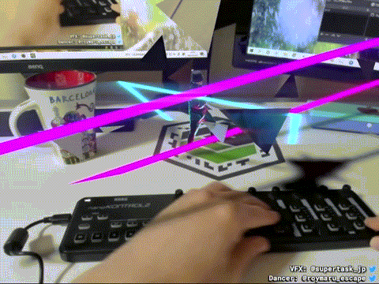

# 4DVFXProject
Volumetric videos captured at Rememory Studio powered by DepthKit Studio

## Ariaray

## Roy

For more detail, look at [AR VJing / POV revolution
](https://opensea.io/assets/0x495f947276749ce646f68ac8c248420045cb7b5e/24839080799599053567585683586329345224812042688023832453838796424732206956545/).

## Mao

Coming soon..

## How dancers are captured & how an app works on Unity

I requested to take Volumetric Video of dancers to [Rememory Studio](https://rememory.jp/jp/studio.html) organized by Curiocity, inc (If you wanna use outside of Japan, please check out [DepthKitStudio](https://www.depthkit.tv/depthkit-studio) ). Here is how the studio looks like.

And while we take the volumetric videos, we could see point cloud data in real-time bellow.

After we finished to take the volumetric videos, [Rememory Studio](https://rememory.jp/jp/studio.html) converted the point cloud data into a mp4 file and a json file.

And I added these files on Unity and played the Volumetric Video with DepthKitStudio's scripts. Then I could see the real-time constructed mesh on Unity.
